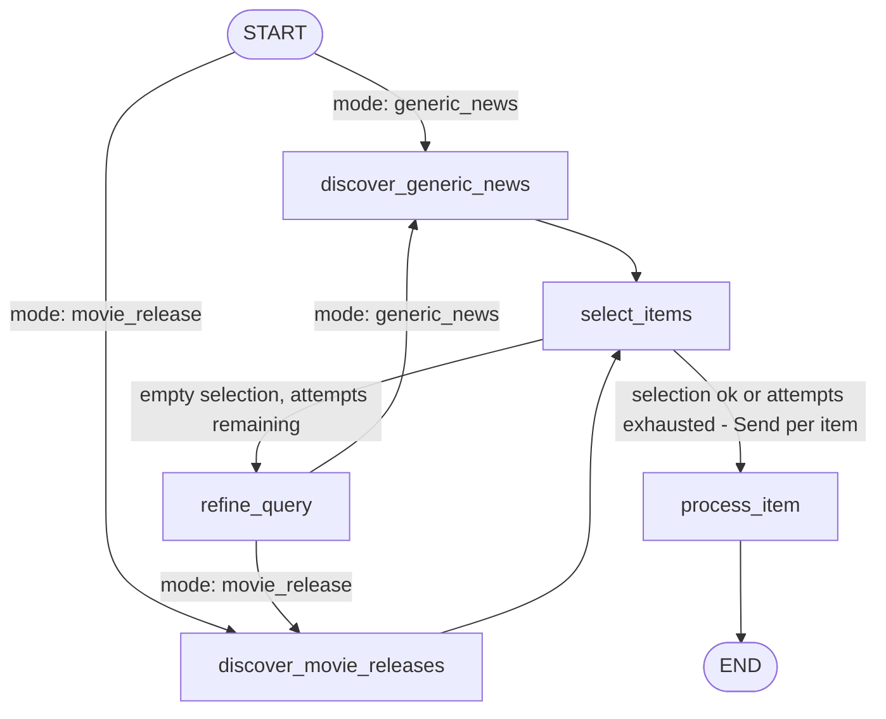

# Cinema Social Media Manager Agent

Multi-agent system built with **LangGraph** that automatically generates Instagram posts for a cinema:
it searches for movie news/releases, selects the best ideas, writes the caption, generates an image
consistent with the brand, and saves everything ready for publication.

Migrated from an initial prototype on Google ADK + Gemini to **LangGraph + OpenAI**, with image
generation via **gpt-image-2**.

## Architecture



- **`discover_generic_news`** / **`discover_movie_releases`**: gather ideas (Tavily search + structured extraction), depending on the mode. Upcoming movies are read from a local CSV (`data/movies.csv`), no longer from Google Calendar.
- **`select_items`**: selects up to `MAX_POSTS_PER_RUN` ideas, discarding those already covered in the last `HISTORY_WINDOW_DAYS` days (persistent history in `data/history.json`).
- **`refine_query`**: if all ideas are discarded, an LLM node rephrases the search direction and returns to discovery (maximum `MAX_DISCOVERY_ATTEMPTS` total attempts).
- **`process_item`**: for each selected idea (run in parallel via `Send`), digs deeper with a focused search, writes the post, generates the image (consistent with the brand template in `data/brand_template.png`) and saves both to disk.

## Setup

```bash
uv sync
cp .env.example .env
```

Fill in `.env` with:
- `OPENAI_API_KEY` — used for all LLMs (text) and for image generation (gpt-image-2)
- `TAVILY_API_KEY` — web search ([tavily.com](https://tavily.com))

Also required:
- `data/movies.csv` — columns `title,release_date,screening_date`
- `data/brand_template.png` — reference image for style/logo/palette of generated posts

## Usage

```bash
uv run social-media-manager-agent --mode generic_news
uv run social-media-manager-agent --mode movie_release
```

Output: one `.json` file per post in `output/posts/` and the corresponding image in `output/images/`.

## Configuration

All numeric/behavioral parameters are in `.env`, no hardcoded values in the code:

| Variable | Description | Default |
|---|---|---|
| `DEFAULT_MODEL` | Default OpenAI model for all text nodes | `gpt-4o-mini` |
| `MODEL_<NODE_NAME>` | Model override for a single node (e.g. `MODEL_WRITE_POST=gpt-4o`) | — |
| `MAX_POSTS_PER_RUN` | Maximum number of posts generated per run | `3` |
| `BROAD_SEARCH_RESULTS` | Tavily results for the broad search (generic news) | `10` |
| `MOVIE_SEARCH_RESULTS` | Tavily results for the broad search for movies | `6` |
| `FOCUSED_SEARCH_RESULTS` | Tavily results for the in-depth search | `4` |
| `HISTORY_WINDOW_DAYS` | Window (days) used to avoid duplicate topics | `15` |
| `MAX_DISCOVERY_ATTEMPTS` | Maximum discovery attempts before giving up | `2` |
| `IMAGE_MODEL` | Model used for image generation | `gpt-image-2` |
| `IMAGE_SIZE` | Generated image size | `1024x1024` |
| `IMAGE_QUALITY` | Generated image quality | `low` |
| `SAVE_FOLDER` | Folder for post JSON files | `./output/posts` |
| `IMAGES_FOLDER` | Folder for generated images | `./output/images` |
| `MOVIES_CSV_PATH` | Path to the upcoming movies CSV | `./data/movies.csv` |
| `BRAND_TEMPLATE_PATH` | Path to the brand identity image | `./data/brand_template.png` |
| `HISTORY_PATH` | Path to the post history | `./data/history.json` |

## Tests

```bash
uv run pytest tests/ -v
```

All tests are deterministic and make no real network calls (LLM and search are mocked where needed, or tested as pure I/O on temporary files).

## Known limitations

- No automatic publishing to social media: the output is JSON + image ready to go, publishing is a future step.
- The list of upcoming movies is manual (CSV), not synced with external sources.
- `legacy_adk_reference/` contains the original prototype on Google ADK/Gemini, kept locally as a historical reference (excluded from the repo via `.gitignore`).
