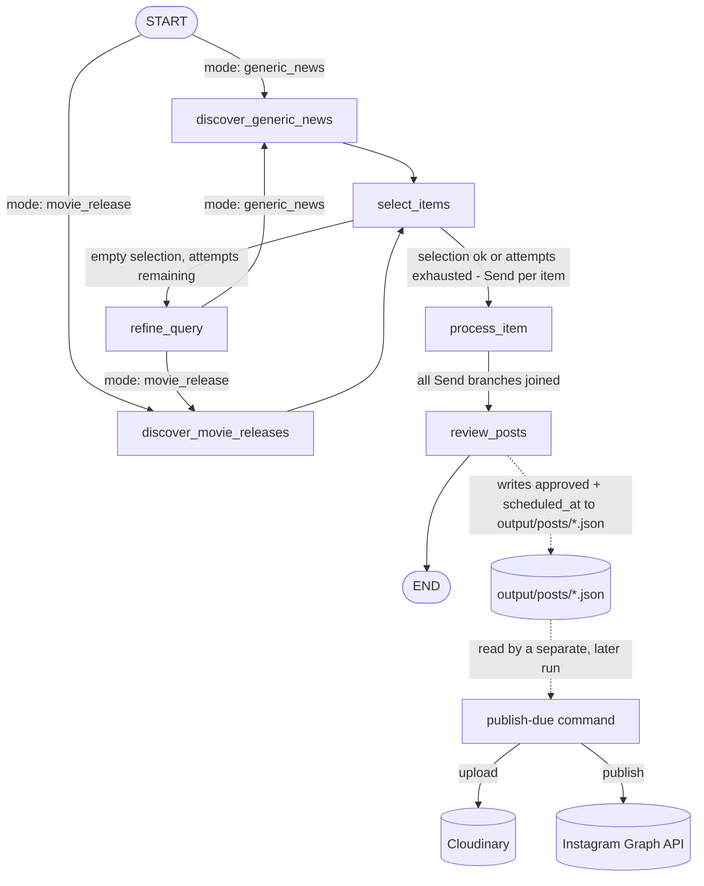

# Cinema Social Media Manager Agent

Multi-agent system built with **LangGraph** that automatically generates, reviews, schedules, and
publishes Instagram posts for a cinema: it searches for movie news/releases, selects the best ideas,
writes the caption, generates an image consistent with the brand, has a reviewer agent approve/reject
and schedule each post, and finally publishes approved posts to Instagram at their scheduled time.

Migrated from an initial prototype on Google ADK + Gemini to **LangGraph + OpenAI**, with image
generation via **gpt-image-2**.

## Architecture

The system is split into two independent parts: a daily **generation graph** (LangGraph) and a
periodic **publishing command** (plain Python, no LLM) that reads whatever the graph left on disk.



- **`discover_generic_news`** / **`discover_movie_releases`**: gather ideas (Tavily search + structured extraction), depending on the mode. Upcoming movies are read from a local CSV (`data/movies.csv`), no longer from Google Calendar.
- **`select_items`**: selects up to `MAX_POSTS_PER_RUN` ideas, discarding those already covered in the last `HISTORY_WINDOW_DAYS` days (persistent history in `data/history.json`).
- **`refine_query`**: if all ideas are discarded, an LLM node rephrases the search direction and returns to discovery (maximum `MAX_DISCOVERY_ATTEMPTS` total attempts).
- **`process_item`**: for each selected idea (run in parallel via `Send`), digs deeper with a focused search, writes the post draft, generates the image (consistent with the brand template in `data/brand_template.png`) and saves both to disk. It no longer decides a publish time.
- **`review_posts`**: runs once per run, after all `process_item` branches join back together, so it sees the *whole batch* at once. For each post it decides `approved` (with a `rejection_reason` if not) and, if approved, a `scheduled_at` time — spacing the batch out sensibly instead of letting each post pick its own time independently. Decisions are written back into the same `output/posts/*.json` files.
- **`publish-due` command** (separate CLI invocation, not part of the graph): scans `output/posts/*.json` for posts that are `approved`, not yet `published`, and whose `scheduled_at` has arrived. For each one it uploads the local image to Cloudinary, verifies the resulting URL is publicly reachable, publishes via the Instagram Graph API, marks the post `published` with its `instagram_media_id`, and deletes the Cloudinary asset once Instagram has ingested it. Deterministic, no LLM involved — meant to be re-run periodically (see [Scheduling](#scheduling) below), independently of and potentially much later than generation.

## Setup

```bash
uv sync
cp .env.example .env
```

Fill in `.env` with:
- `OPENAI_API_KEY` — used for all LLMs (text) and for image generation (gpt-image-2)
- `TAVILY_API_KEY` — web search ([tavily.com](https://tavily.com))
- `CINEMA_NAME`, `POST_LANGUAGE` — brand identity used in prompts
- `CLOUDINARY_CLOUD_NAME`, `CLOUDINARY_API_KEY`, `CLOUDINARY_API_SECRET` — from a free [Cloudinary](https://cloudinary.com) account, used to get a public URL for each image (Instagram's API requires a public URL, it can't take raw image bytes). We switched from imgbb after finding its URLs are unreliably fetchable by Instagram's Graph API crawler specifically (a widely-reported issue, unrelated to this project); each upload is now deleted from Cloudinary once it's no longer needed — see [Cloudinary notes](#cloudinary-notes) below.
- `IG_USER_ID`, `IG_ACCESS_TOKEN` — from a Meta developer app with Instagram API access. **Important**: which Graph API host to use depends on how the token was issued — see [Instagram publishing notes](#instagram-publishing-notes) below, this trips people up.

Also required:
- `data/movies.csv` — columns `title,release_date`
- `data/brand_template.png` — reference image for style/logo/palette of generated posts

## Usage

```bash
uv run social-media-manager-agent generate --mode generic_news
uv run social-media-manager-agent generate --mode movie_release
```

Output: one `.json` file per post in `output/posts/` and the corresponding image in `output/images/`.
Each generated batch is also reviewed automatically as part of the same run: every post ends up with
`approved` + `scheduled_at` (or a `rejection_reason`) written back into its JSON file.

```bash
uv run social-media-manager-agent publish-due
```

Publishes whichever approved posts have reached their `scheduled_at`: uploads the image to Cloudinary,
waits until the resulting URL is confirmed publicly reachable, then publishes via the Instagram Graph
API. Safe to re-run any time — posts already marked `published` are skipped, so it won't double-post.

## Scheduling

Neither command runs on a schedule by itself. This project intentionally doesn't run a background
daemon — instead, schedule both commands with **Windows Task Scheduler** (`taskschd.msc`):

1. **Daily generation** — one task, once a day, running:
   ```
   uv run social-media-manager-agent generate --mode generic_news
   ```
   (or `movie_release`, or one task per mode if you want both every day). Set the "Start in" directory
   to the project root so `.env` and relative paths (`data/`, `output/`) resolve correctly.

2. **Periodic publishing** — a second task, repeating every ~15 minutes, running:
   ```
   uv run social-media-manager-agent publish-due
   ```
   The interval just controls how close to the reviewer's chosen `scheduled_at` a post actually goes
   live (worst case, `scheduled_at` + interval) — it doesn't need to be exact, and overlapping runs
   aren't a concern as long as one run finishes before the next starts (there's no cross-run locking).

Both commands log to `output/agent.log` in addition to stdout, so a scheduled/non-interactive run still
leaves a record to check.

## Configuration

All numeric/behavioral parameters are in `.env`, no hardcoded values in the code:

| Variable | Description | Default |
|---|---|---|
| `DEFAULT_MODEL` | Default OpenAI model for all text nodes | `gpt-4o-mini` |
| `MODEL_<NODE_NAME>` | Model override for a single node (e.g. `MODEL_WRITE_POST=gpt-4o`, `MODEL_REVIEW_POSTS=gpt-4o`) | — |
| `MAX_POSTS_PER_RUN` | Maximum number of posts generated per run | `3` |
| `BROAD_SEARCH_RESULTS` | Tavily results for the broad search (generic news) | `10` |
| `MOVIE_SEARCH_RESULTS` | Tavily results for the broad search for movies | `6` |
| `FOCUSED_SEARCH_RESULTS` | Tavily results for the in-depth search | `4` |
| `HISTORY_WINDOW_DAYS` | Window (days) used to avoid duplicate topics | `15` |
| `MAX_DISCOVERY_ATTEMPTS` | Maximum discovery attempts before giving up | `2` |
| `IMAGE_MODEL` | Model used for image generation | `gpt-image-2` |
| `IMAGE_SIZE` | Generated image size | `1024x1024` |
| `IMAGE_QUALITY` | Generated image quality | `low` |
| `SAVE_FOLDER` | Folder for post JSON files | `./output/posts` |
| `IMAGES_FOLDER` | Folder for generated images | `./output/images` |
| `MOVIES_CSV_PATH` | Path to the upcoming movies CSV | `./data/movies.csv` |
| `BRAND_TEMPLATE_PATH` | Path to the brand identity image | `./data/brand_template.png` |
| `HISTORY_PATH` | Path to the post history | `./data/history.json` |
| `CLOUDINARY_CLOUD_NAME` | Cloud name from your [Cloudinary](https://cloudinary.com) account | — (required) |
| `CLOUDINARY_API_KEY` | API key from your Cloudinary account | — (required) |
| `CLOUDINARY_API_SECRET` | API secret from your Cloudinary account, used to sign upload requests | — (required) |
| `IG_USER_ID` | Instagram professional account ID to publish to | — (required) |
| `IG_ACCESS_TOKEN` | Access token for that account | — (required) |
| `GRAPH_API_VERSION` | Meta Graph API version to call | `v21.0` |

## Instagram publishing notes

Meta has **two different ways** to get Instagram API access, and they use different Graph API hosts —
using the wrong one fails with a confusing `"Invalid OAuth access token - Cannot parse access token"`
(code 190), which looks like a bad token even though the token itself is fine:

- **"Instagram API with Instagram Login"** — token issued directly for an Instagram professional
  account, typically starts with `IGAA...`. Must call **`https://graph.instagram.com`**. This is what
  [tools/instagram.py](src/social_media_manager_agent/tools/instagram.py) uses (`GRAPH_API_BASE`).
- **"Instagram API with Facebook Login"** — token tied to a Facebook Page linked to the Instagram
  account, typically starts with `EAA...`. Must call `https://graph.facebook.com` instead.

If your `IG_ACCESS_TOKEN` starts with `EAA`, change `GRAPH_API_BASE` in `tools/instagram.py` to
`https://graph.facebook.com`.

## Cloudinary notes

Instagram's Graph API needs a **public URL** for the image, not raw bytes, so the publish step uploads
to Cloudinary first ([tools/cloudinary.py](src/social_media_manager_agent/tools/cloudinary.py), signed
upload via `CLOUDINARY_API_KEY`/`CLOUDINARY_API_SECRET`), then waits until the resulting `secure_url` is
confirmed publicly fetchable (`wait_until_publicly_reachable`, a plain `GET` checked for status 200 and
an `image/*` content type, retried a few times with a short backoff) before handing it to Instagram.

We moved off imgbb because its URLs were intermittently unreachable specifically for Instagram's Graph
API crawler (`error_subcode 2207052` / `"Only photo or video can be accepted as media type"`), even
though the same URLs were reliably fetchable from our own machine and worked fine on other platforms —
a known, widely-reported incompatibility between imgbb and Instagram's fetcher, not something fixable by
waiting longer.

Each uploaded image **is deleted from Cloudinary** once it's no longer needed: right after a successful
Instagram publish (Instagram has already fully fetched and processed the image by the time
`publish_image_post` returns, so the Cloudinary copy isn't needed anymore), or as a best-effort cleanup
if the upload succeeded but a later step (reachability check or Instagram publish) failed, to avoid
leaving an orphaned asset behind. The `public_id` returned by the upload is persisted on the post's JSON
record (`cloudinary_public_id`) as soon as the upload succeeds, and cleared once the delete succeeds —
so if the delete itself fails after its retries are exhausted (Cloudinary outage, rotated secret, etc.),
the field stays populated as a durable marker: any `output/posts/*.json` with a non-null
`cloudinary_public_id` still has an asset on Cloudinary worth cleaning up manually. Images uploaded
before this change was introduced have no such marker and can't be reconciled automatically. A delete
failure never affects publishing itself — a post that published successfully stays `published` even if
its Cloudinary cleanup didn't go through.

## Tests

```bash
uv run pytest tests/ -v
```

All tests are deterministic and make no real network calls (LLM, search, Cloudinary, and Instagram Graph
API calls are all mocked where needed, or tested as pure I/O on temporary files).

## Known limitations

- The list of upcoming movies is manual (CSV), not synced with external sources.
