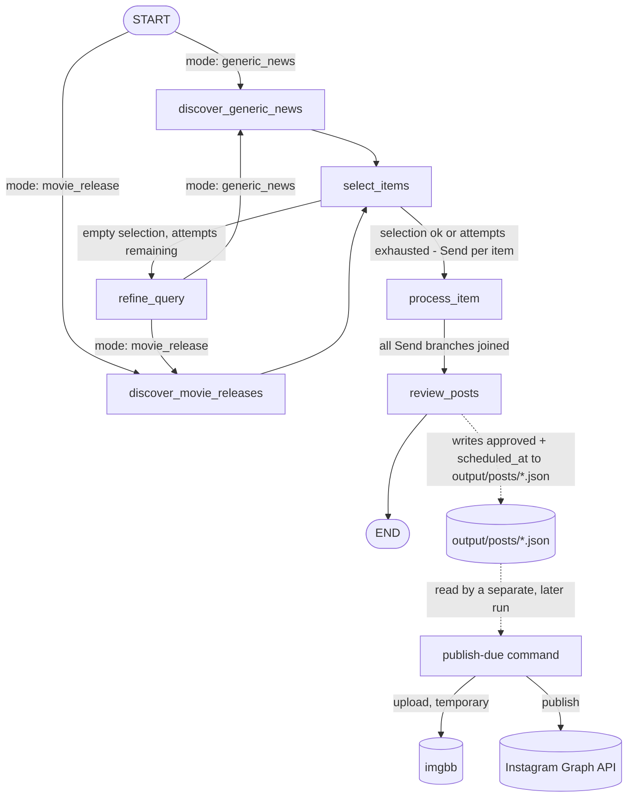

# Cinema Social Media Manager Agent

Multi-agent system built with **LangGraph** that automatically generates, reviews, schedules, and
publishes Instagram posts for a cinema: it searches for movie news/releases, selects the best ideas,
writes the caption, generates an image consistent with the brand, has a reviewer agent approve/reject
and schedule each post, and finally publishes approved posts to Instagram at their scheduled time.

Migrated from an initial prototype on Google ADK + Gemini to **LangGraph + OpenAI**, with image
generation via **gpt-image-2**.

## Architecture

The system is split into two independent parts: a daily **generation graph** (LangGraph) and a
periodic **publishing command** (plain Python, no LLM) that reads whatever the graph left on disk.



- **`discover_generic_news`** / **`discover_movie_releases`**: gather ideas (Tavily search + structured extraction), depending on the mode. Upcoming movies are read from a local CSV (`data/movies.csv`), no longer from Google Calendar.
- **`select_items`**: selects up to `MAX_POSTS_PER_RUN` ideas, discarding those already covered in the last `HISTORY_WINDOW_DAYS` days (persistent history in `data/history.json`).
- **`refine_query`**: if all ideas are discarded, an LLM node rephrases the search direction and returns to discovery (maximum `MAX_DISCOVERY_ATTEMPTS` total attempts).
- **`process_item`**: for each selected idea (run in parallel via `Send`), digs deeper with a focused search, writes the post draft, generates the image (consistent with the brand template in `data/brand_template.png`) and saves both to disk. It no longer decides a publish time.
- **`review_posts`**: runs once per run, after all `process_item` branches join back together, so it sees the *whole batch* at once. For each post it decides `approved` (with a `rejection_reason` if not) and, if approved, a `scheduled_at` time — spacing the batch out sensibly instead of letting each post pick its own time independently. Decisions are written back into the same `output/posts/*.json` files.
- **`publish-due` command** (separate CLI invocation, not part of the graph): scans `output/posts/*.json` for posts that are `approved`, not yet `published`, and whose `scheduled_at` has arrived. For each one it uploads the local image to imgbb, publishes via the Instagram Graph API, and marks the post `published` with its `instagram_media_id`. Deterministic, no LLM involved — meant to be re-run periodically (see [Scheduling](#scheduling) below), independently of and potentially much later than generation.

## Setup

```bash
uv sync
cp .env.example .env
```

Fill in `.env` with:
- `OPENAI_API_KEY` — used for all LLMs (text) and for image generation (gpt-image-2)
- `TAVILY_API_KEY` — web search ([tavily.com](https://tavily.com))
- `CINEMA_NAME`, `POST_LANGUAGE` — brand identity used in prompts
- `IMGBB_API_KEY` — [api.imgbb.com](https://api.imgbb.com), used to get a temporary public URL for each image (Instagram's API requires a public URL, it can't take raw image bytes)
- `IG_USER_ID`, `IG_ACCESS_TOKEN` — from a Meta developer app with Instagram API access. **Important**: which Graph API host to use depends on how the token was issued — see [Instagram publishing notes](#instagram-publishing-notes) below, this trips people up.

Also required:
- `data/movies.csv` — columns `title,release_date,screening_date`
- `data/brand_template.png` — reference image for style/logo/palette of generated posts

## Usage

```bash
uv run social-media-manager-agent generate --mode generic_news
uv run social-media-manager-agent generate --mode movie_release
```

Output: one `.json` file per post in `output/posts/` and the corresponding image in `output/images/`.
Each generated batch is also reviewed automatically as part of the same run: every post ends up with
`approved` + `scheduled_at` (or a `rejection_reason`) written back into its JSON file.

```bash
uv run social-media-manager-agent publish-due
```

Publishes whichever approved posts have reached their `scheduled_at`: uploads the image to imgbb with a
short auto-expiration (so it self-deletes on imgbb's side shortly after, no manual cleanup call needed —
see [notes](#imgbb-notes) below), then publishes via the Instagram Graph API. Safe to re-run any time —
posts already marked `published` are skipped, so it won't double-post.

## Scheduling

Neither command runs on a schedule by itself. This project intentionally doesn't run a background
daemon — instead, schedule both commands with **Windows Task Scheduler** (`taskschd.msc`):

1. **Daily generation** — one task, once a day, running:
   ```
   uv run social-media-manager-agent generate --mode generic_news
   ```
   (or `movie_release`, or one task per mode if you want both every day). Set the "Start in" directory
   to the project root so `.env` and relative paths (`data/`, `output/`) resolve correctly.

2. **Periodic publishing** — a second task, repeating every ~15 minutes, running:
   ```
   uv run social-media-manager-agent publish-due
   ```
   The interval just controls how close to the reviewer's chosen `scheduled_at` a post actually goes
   live (worst case, `scheduled_at` + interval) — it doesn't need to be exact, and overlapping runs
   aren't a concern as long as one run finishes before the next starts (there's no cross-run locking).

Both commands log to `output/agent.log` in addition to stdout, so a scheduled/non-interactive run still
leaves a record to check.

## Configuration

All numeric/behavioral parameters are in `.env`, no hardcoded values in the code:

| Variable | Description | Default |
|---|---|---|
| `DEFAULT_MODEL` | Default OpenAI model for all text nodes | `gpt-4o-mini` |
| `MODEL_<NODE_NAME>` | Model override for a single node (e.g. `MODEL_WRITE_POST=gpt-4o`, `MODEL_REVIEW_POSTS=gpt-4o`) | — |
| `MAX_POSTS_PER_RUN` | Maximum number of posts generated per run | `3` |
| `BROAD_SEARCH_RESULTS` | Tavily results for the broad search (generic news) | `10` |
| `MOVIE_SEARCH_RESULTS` | Tavily results for the broad search for movies | `6` |
| `FOCUSED_SEARCH_RESULTS` | Tavily results for the in-depth search | `4` |
| `HISTORY_WINDOW_DAYS` | Window (days) used to avoid duplicate topics | `15` |
| `MAX_DISCOVERY_ATTEMPTS` | Maximum discovery attempts before giving up | `2` |
| `IMAGE_MODEL` | Model used for image generation | `gpt-image-2` |
| `IMAGE_SIZE` | Generated image size | `1024x1024` |
| `IMAGE_QUALITY` | Generated image quality | `low` |
| `SAVE_FOLDER` | Folder for post JSON files | `./output/posts` |
| `IMAGES_FOLDER` | Folder for generated images | `./output/images` |
| `MOVIES_CSV_PATH` | Path to the upcoming movies CSV | `./data/movies.csv` |
| `BRAND_TEMPLATE_PATH` | Path to the brand identity image | `./data/brand_template.png` |
| `HISTORY_PATH` | Path to the post history | `./data/history.json` |
| `IMGBB_API_KEY` | API key from [api.imgbb.com](https://api.imgbb.com) | — (required) |
| `IMGBB_EXPIRATION_SECONDS` | How long an uploaded image stays on imgbb before auto-deleting. Must be **≥ 60** — imgbb silently disables expiration (image never deleted) for lower values instead of erroring, so this is enforced at startup | `600` |
| `IG_USER_ID` | Instagram professional account ID to publish to | — (required) |
| `IG_ACCESS_TOKEN` | Access token for that account | — (required) |
| `GRAPH_API_VERSION` | Meta Graph API version to call | `v21.0` |

## Instagram publishing notes

Meta has **two different ways** to get Instagram API access, and they use different Graph API hosts —
using the wrong one fails with a confusing `"Invalid OAuth access token - Cannot parse access token"`
(code 190), which looks like a bad token even though the token itself is fine:

- **"Instagram API with Instagram Login"** — token issued directly for an Instagram professional
  account, typically starts with `IGAA...`. Must call **`https://graph.instagram.com`**. This is what
  [tools/instagram.py](src/social_media_manager_agent/tools/instagram.py) uses (`GRAPH_API_BASE`).
- **"Instagram API with Facebook Login"** — token tied to a Facebook Page linked to the Instagram
  account, typically starts with `EAA...`. Must call `https://graph.facebook.com` instead.

If your `IG_ACCESS_TOKEN` starts with `EAA`, change `GRAPH_API_BASE` in `tools/instagram.py` to
`https://graph.facebook.com`.

## imgbb notes

Instagram's Graph API needs a **public URL** for the image, not raw bytes, so the publish step uploads
to imgbb just long enough for Instagram's servers to fetch it, then lets it expire on its own via the
`expiration` upload parameter (`IMGBB_EXPIRATION_SECONDS`). Two things worth knowing if you touch this:

- The `delete_url` returned by imgbb's upload API does **not** work as a programmatic delete endpoint —
  it's a link to imgbb's web page for the image (a plain `GET` just loads the page, nothing gets
  deleted). `expiration` is the only reliable way to auto-clean an upload without a logged-in browser
  session.
- Deletion via `expiration` is not instant — there's a short lag after the timer expires before imgbb
  actually purges the file (observed to be roughly a couple of minutes in testing). The default of 600s
  gives comfortable headroom over both that lag and the time Instagram needs to fetch the image.

## Tests

```bash
uv run pytest tests/ -v
```

All tests are deterministic and make no real network calls (LLM, search, imgbb, and Instagram Graph API
calls are all mocked where needed, or tested as pure I/O on temporary files).

## Known limitations

- The list of upcoming movies is manual (CSV), not synced with external sources.
- No cross-run locking on `publish-due` — don't run it concurrently with itself, or a post could in
  theory get published twice if two runs both read it as not-yet-published before either writes back.
